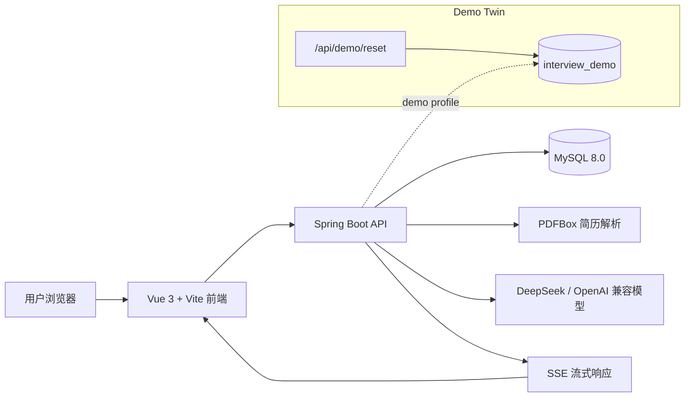
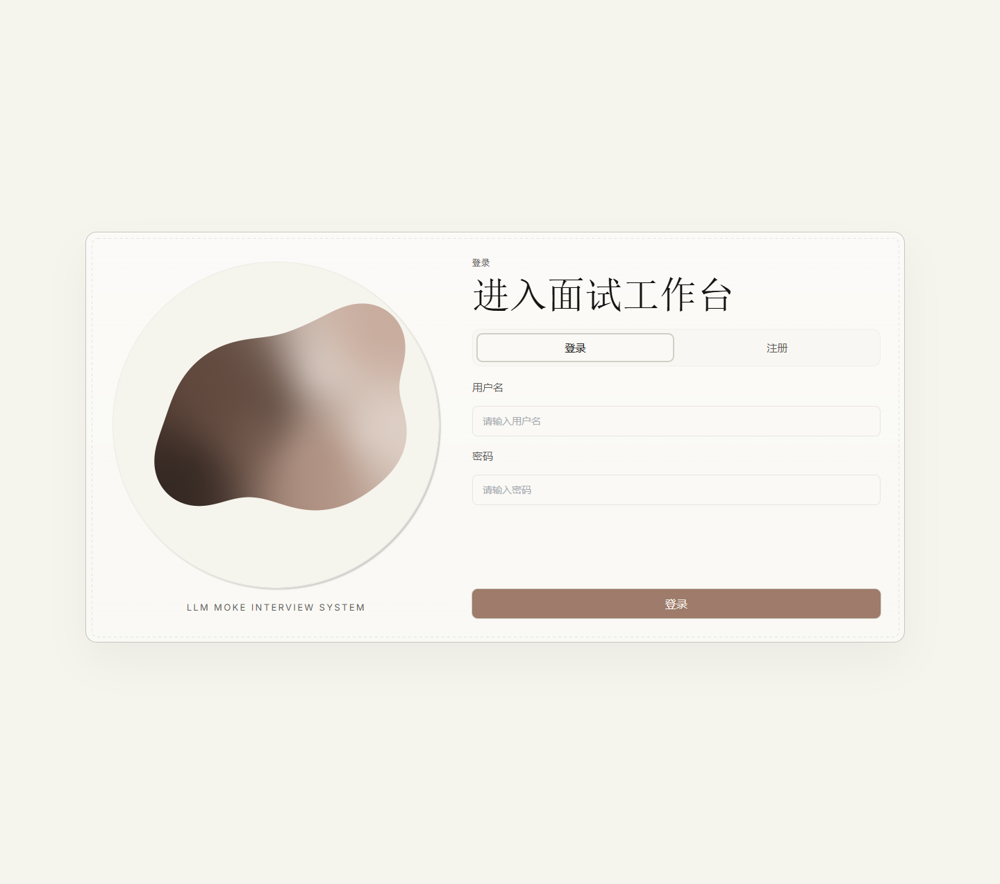
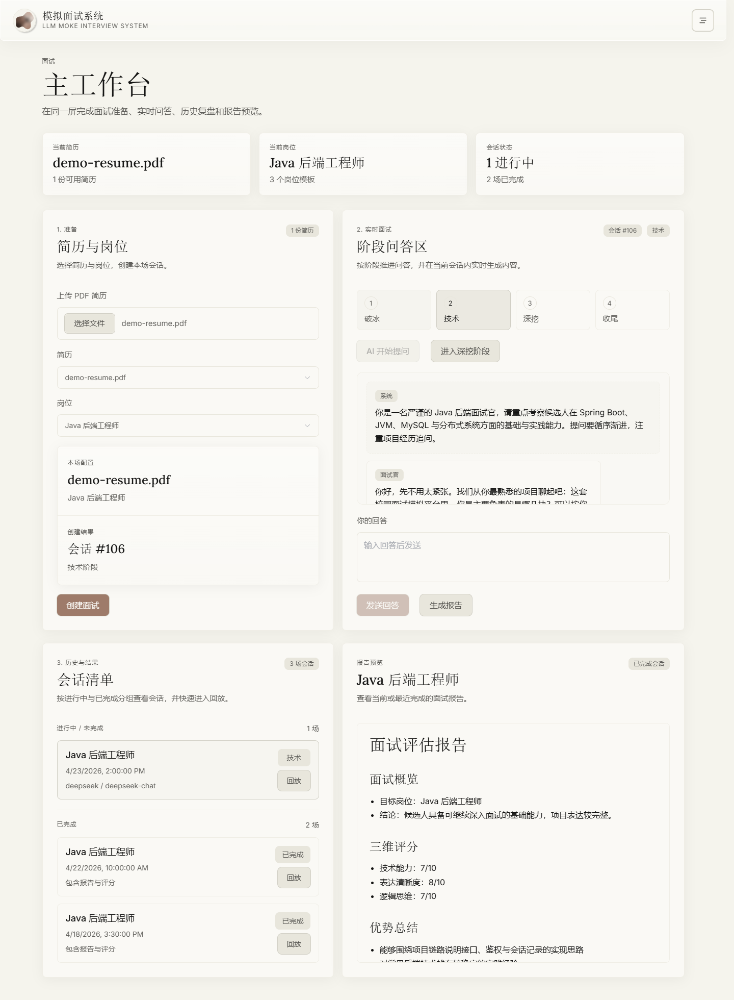
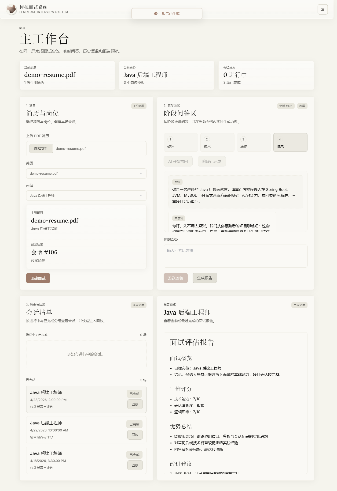
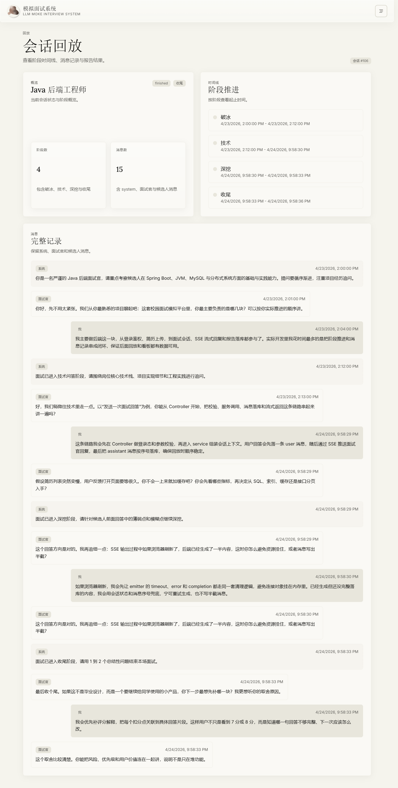
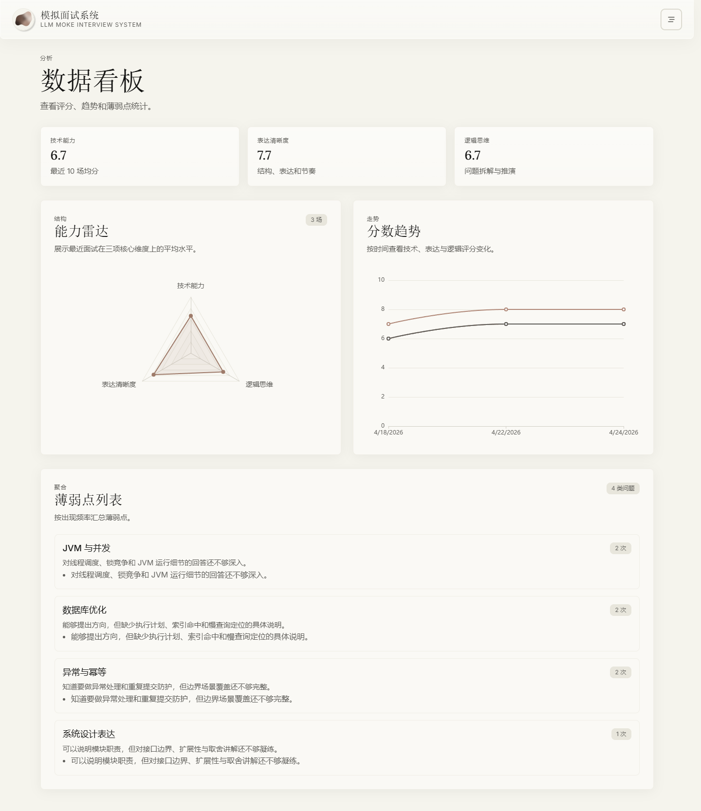

# 沉浸式模拟面试与简历诊断系统


> 毕业设计项目：沉浸式模拟面试与简历诊断系统

基于大语言模型的模拟面试平台，覆盖简历解析、岗位匹配、阶段化问答、会话回放、报告生成和能力分析。项目同时提供真实运行模式与 Demo Twin 演示模式，便于本地开发、答辩演示和截图验收。

## 项目亮点

- 支持 PDF 简历解析、岗位模板匹配、阶段化模拟面试和 Markdown 评估报告生成。
- 使用 SSE 实现流式问答体验，完整保留阶段推进、系统提示和消息回放。
- 提供 Demo Twin 演示模式，数据库、端口、前端环境与真实模式隔离。
- 支持用户级 LLM Provider、模型和 API Key 配置，Key 使用 AES-256-GCM 加密保存。
- 提供能力雷达图、评分趋势和薄弱点统计，形成从面试到复盘的闭环。

## 系统架构



## 界面预览

### 登录



### 主工作台



### 技术阶段


### 报告生成



### 会话回放



### 数据看板



## 技术栈

- 后端：Java 21、Spring Boot 3.2、MyBatis-Plus、MySQL 8.0、PDFBox、OkHttp、JWT、BCrypt、AES-256-GCM
- 前端：Vue 3、TypeScript、Vite、Element Plus、Vue Router、Pinia、Axios、markdown-it、ECharts
- 模型接口：DeepSeek API、OpenAI 兼容 Chat Completions 协议
- 流式通信：Spring `SseEmitter` + 前端 `fetch` / `ReadableStream`

## 目录结构

```text
E:\graduation-project
├── README.md
├── DESIGN-SPEC.md
├── interview-backend          # Spring Boot 后端
├── interview-frontend         # Vue 前端
├── scripts                    # 启动、重置和截图脚本
│   ├── demo
│   └── real
├── output                     # Demo 截图、运行产物与审查材料
├── thesis-assets              # 论文材料
├── thesis-handbook            # 毕设手册
├── start-real.bat             # 真实版双击启动入口
└── start-demo.bat             # Demo Twin 双击启动入口
```

## 环境要求

- Windows 11
- PowerShell 7+
- Java 21
- Maven 3.9+
- Node.js 20+ 与 npm
- MySQL 8.0

启动脚本不会启动 Redis。脚本会尝试连接或拉起本机 MySQL；如果本机服务不可用，需要先手动启动 MySQL。

## 配置

### 后端本地配置

复制后端配置模板：

```powershell
Copy-Item .\interview-backend\src\main\resources\application-local.example.yml `
  .\interview-backend\src\main\resources\application-local.yml
```

修改 `application-local.yml`：

```yaml
spring:
  datasource:
    url: jdbc:mysql://localhost:3306/interview_system?useUnicode=true&characterEncoding=utf8&serverTimezone=Asia/Shanghai
    username: root
    password: your_mysql_password

jwt:
  secret: replace-with-at-least-32-bytes-jwt-secret

app:
  crypto:
    aes-secret: replace-with-at-least-32-bytes-aes-secret

deepseek:
  api-key: your_deepseek_key
```

`application-local.yml` 已被 `.gitignore` 忽略，不要提交真实数据库密码、JWT secret、AES secret 或模型 Key。

### 前端本地配置

复制前端配置模板：

```powershell
Copy-Item .\interview-frontend\.env.example .\interview-frontend\.env.local
```

默认真实版配置：

```env
VITE_PORT=5173
VITE_PROXY_TARGET=http://127.0.0.1:8080
VITE_HOST=127.0.0.1
```

Demo 前端固定使用 `interview-frontend/.env.demo`：

```env
VITE_PORT=5174
VITE_PROXY_TARGET=http://127.0.0.1:8081
```

### 数据库

真实版数据库：

```powershell
mysql -uroot -p -e "CREATE DATABASE IF NOT EXISTS interview_system DEFAULT CHARACTER SET utf8mb4 COLLATE utf8mb4_unicode_ci;"
```

Demo 数据库：

```powershell
mysql -uroot -p -e "CREATE DATABASE IF NOT EXISTS interview_demo DEFAULT CHARACTER SET utf8mb4 COLLATE utf8mb4_unicode_ci;"
```

真实模式默认只初始化岗位模板和 LLM Provider 基础数据。Demo 模式额外加载 `data-demo.sql`，并由 `/api/demo/reset` 重建完整演示闭环。

## 本地启动

真实版：

```powershell
.\start-real.bat
```

- 后端：`http://127.0.0.1:8080`
- 前端：`http://127.0.0.1:5173`
- 健康检查：`http://127.0.0.1:8080/api/health`

Demo Twin：

```powershell
.\start-demo.bat
```

- 后端：`http://127.0.0.1:8081`
- 前端：`http://127.0.0.1:5174`
- 健康检查：`http://127.0.0.1:8081/api/health`

真实版和 Demo 版的端口、数据库、前端环境与登录态相互隔离。

## Demo 数据

重置演示数据：

```powershell
powershell -ExecutionPolicy Bypass -File .\scripts\demo\reset-demo.ps1
```

`/api/demo/reset` 会重建演示账号、默认 LLM 配置、演示简历、进行中会话、已完成会话、回放、报告、评分历史和薄弱点数据。

默认演示账号：

```text
demo / 123456
```

生成 Demo 截图：

```powershell
powershell -ExecutionPolicy Bypass -File .\scripts\demo\capture-demo.ps1
```

截图输出目录：

```text
output\demo\screenshots
```

截图清单输出到：

```text
output\demo\manifest.md
```

## 主要页面

- `/login`：登录 / 注册
- `/interview`：主工作台
- `/interview/replay/:sessionId`：会话回放
- `/resumes`：简历管理
- `/analytics`：数据看板
- `/settings/llm`：LLM 配置
- `/settings/profile`：用户设置

## 核心接口

认证与基础数据：

- `POST /api/auth/register`
- `POST /api/auth/login`
- `GET /api/health`
- `GET /api/position/list`

LLM 与用户设置：

- `GET /api/llm/providers`
- `GET /api/user/llm-config`
- `PUT /api/user/llm-config`
- `GET /api/user/profile`
- `PUT /api/user/profile`

简历与面试：

- `POST /api/resume/upload`
- `GET /api/resume/list`
- `DELETE /api/resume/{resumeId}`
- `POST /api/interview/start`
- `GET /api/interview/sessions`
- `GET /api/interview/{sessionId}/messages`
- `POST /api/interview/{sessionId}/chat`
- `POST /api/interview/{sessionId}/stage`
- `POST /api/interview/{sessionId}/finish`

数据分析：

- `GET /api/analytics/radar`
- `GET /api/analytics/trend`
- `GET /api/analytics/weaknesses`

## 验证命令

后端编译：

```powershell
cd .\interview-backend
mvn -q -DskipTests compile
```

前端构建：

```powershell
cd .\interview-frontend
npm run build
```

Demo 链路验收：

```powershell
.\start-demo.bat
powershell -ExecutionPolicy Bypass -File .\scripts\demo\reset-demo.ps1
powershell -ExecutionPolicy Bypass -File .\scripts\demo\capture-demo.ps1
```

## CI

仓库包含 GitHub Actions 工作流 `.github/workflows/ci.yml`：

- Windows runner
- Java 21
- Node.js 20
- 后端执行 `mvn -q -DskipTests compile`
- 前端执行 `npm ci` 与 `npm run build`

## 注意事项

- 真实版不会自动插入 `demo / 123456` 用户；Demo 用户只在 Demo profile 下加载。
- JWT secret 和 AES secret 必须通过本地配置或环境变量提供，避免误用默认密钥。
- CORS 允许源由 `app.cors.allowed-origins` 配置驱动，部署到其他地址时只需调整配置。
- 双击启动脚本更接近手动启动方式：分别打开后端和前端命令窗口，停止服务时关闭窗口或按 `Ctrl+C`。
